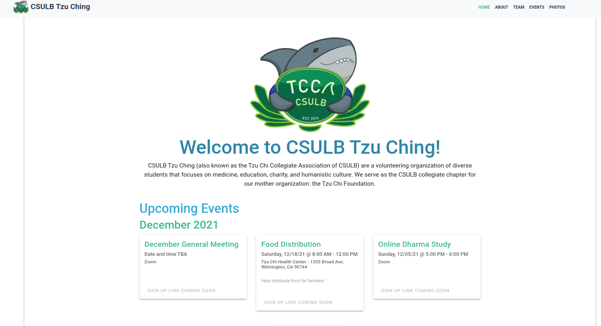
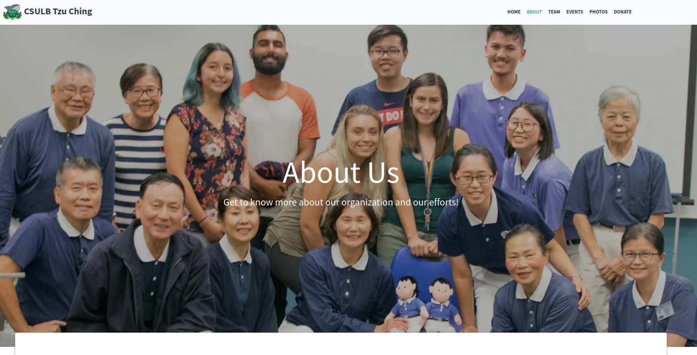
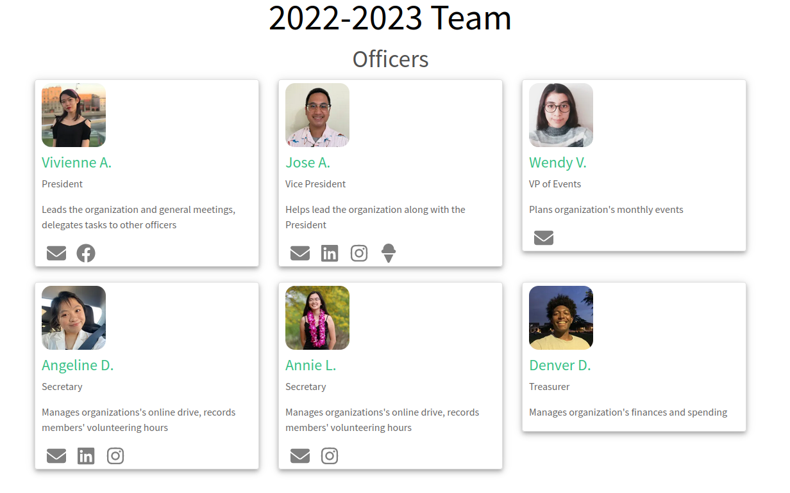
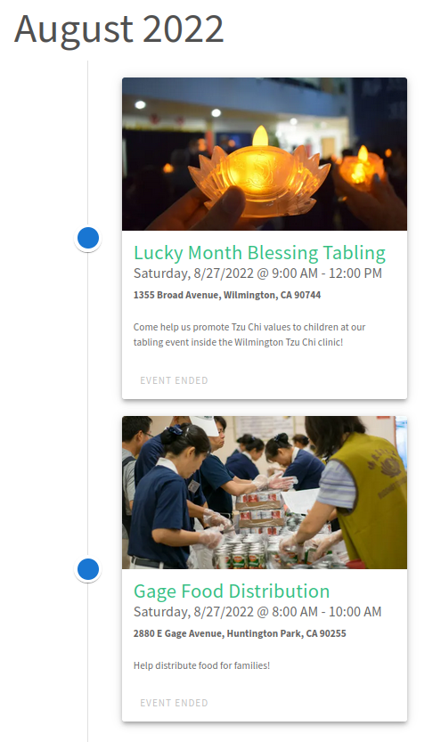

<h1 align="center">CSULB Tzu Ching</h1>

"With open arms and helping hands, our volunteers are here to serve you"

CSULB Tzu Ching (tzu - "compassionate", ching - "youth") is a charity and volunteering organization at California State University, Long Beach. It is the CSULB collegiate chapter of the global relief organization, the Tzu Chi Foundation; it was founded in 2014 and consists of many students from diverse backgrounds, majors, ethnicities, and more. Our general meetings are once a month and we provide diverse range of events for members to attend, such as food-packing events, medical outreaches, senior center visits, and socials.

This website is for showcasing information about us, upcoming and past events, board members, and photos

[Click here to visit the site (csulbtzuching.org)](https://www.csulbtzuching.org)

## Tech Stack

- [Vue.js](https://vuejs.org/) - open-source front end JS framework
- [Vuetify](https://vuetifyjs.com/en/) - material design framework for Vue.js
- [Animate.css](https://animate.style/) - library of animations
- [Animate on Scroll (AOS)](https://michalsnik.github.io/aos/) - library of animations when scrolling

## Future Plans

- contact page

## Donations

Donations are greatly appreciated because they help keep the website online! If you want to support our organization, then consider donating!

## Images

